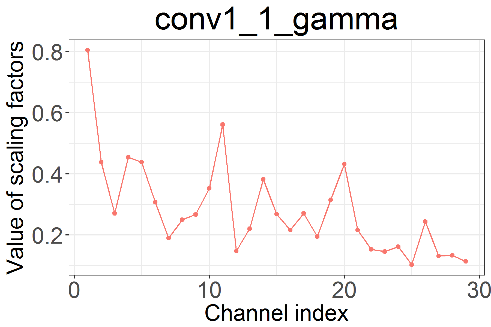
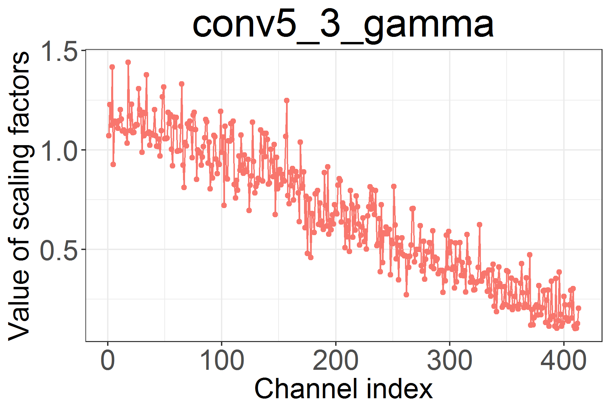
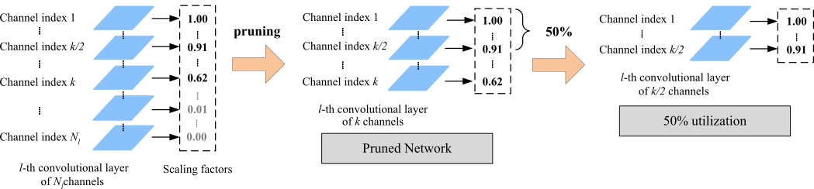
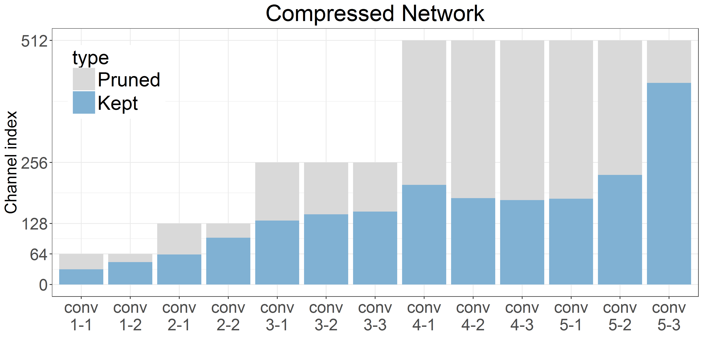
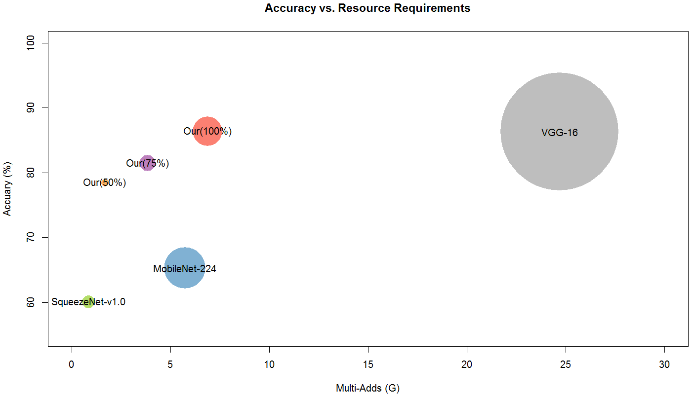

## Quick start
- Test accuracy: 86.395%, rank 2 on [leaderboard](https://www.kaggle.com/c/2018-spring-dlcv-final-project-2/leaderboard); validation accuracy: 86.166%
```
bash run.sh test_image_path output_filename
```
- Environment requirements
```
pip install -r requirements.txt
```
### Dependency
`Python3` `tensorflow` `pytorch` `keras` `imgaug` `numpy` `sklearn` `matplotlib` `skimage` `pandas` `torchvision` `tensorboardX`

--------

## Baseline
- We always train a baseline model first __without any constraints__.
```
python3 train.py -tp train_path -tf train_file_txt -vp valid_path -vf valid_file_txt -s save_dir 
```
- Add these three arguments, ```-ls 0.0 -lm 0.0 -pt all-one```, to the above command.

## Train
- Train an efficient VGG-16 with sparsity penalty and monotonicity-induced penalty
```
python3 train.py -tp train_path -tf train_file_txt -vp valid_path -vf valid_file_txt -s save_dir
```
- A dictionary, named para_dict.npy, will be stored into the specified directory (save_dir).
- We suggest to leverage the baseline model as the pre-trained model by adding argument
```
-i baseline_model_npy
```
- Example of prioritized channels

| 
:-----------------------------:|:------------------------------:


## Prune
- Prune a model based on the magnitude of scaling factors by a threshold (default=0.05)
```
python3 sparsify.py -i input_npy -o output_npy -th threshold
```



- Get a sub-model, for example: given a proportion = 1/2 = 50%
```
python3 stratify.py -i input_npy -o output_npy -dp (0,1]
```

- Visualization of pruned network



## Finetune
- Finetune the pruned model
```
python3 finetune.py -i sparse_npy -tp train_path -tf train_file_txt -vp valid_path -vf valid_file_txt -s save_dir
```
- A finalized dictionary, also named para_dict.npy, will be stored into the specified directory (save_dir). 

## Test
Test the finalized model
```
python3 test.py -i finalized_npy -o output_csv_file -tp test_path
```



## Trained Model
* [baseline](https://www.dropbox.com/s/c1u540426hxb0bc/save_baseline.zip?dl=0)
* [sparse w/o finetuning](https://www.dropbox.com/s/3v8f2cuv3wf9f2u/save_full.zip?dl=0)
* [finalized](https://www.dropbox.com/s/9dkpvttpymbxlr4/save_finetune.zip?dl=0)

## Authors
[Chun-Min Chang](https://github.com/twcmchang/DLCV2018SPRING/tree/master/final), Tsun-Hsien Tang, Chia-Ching Lin, Kai-Chun Su
